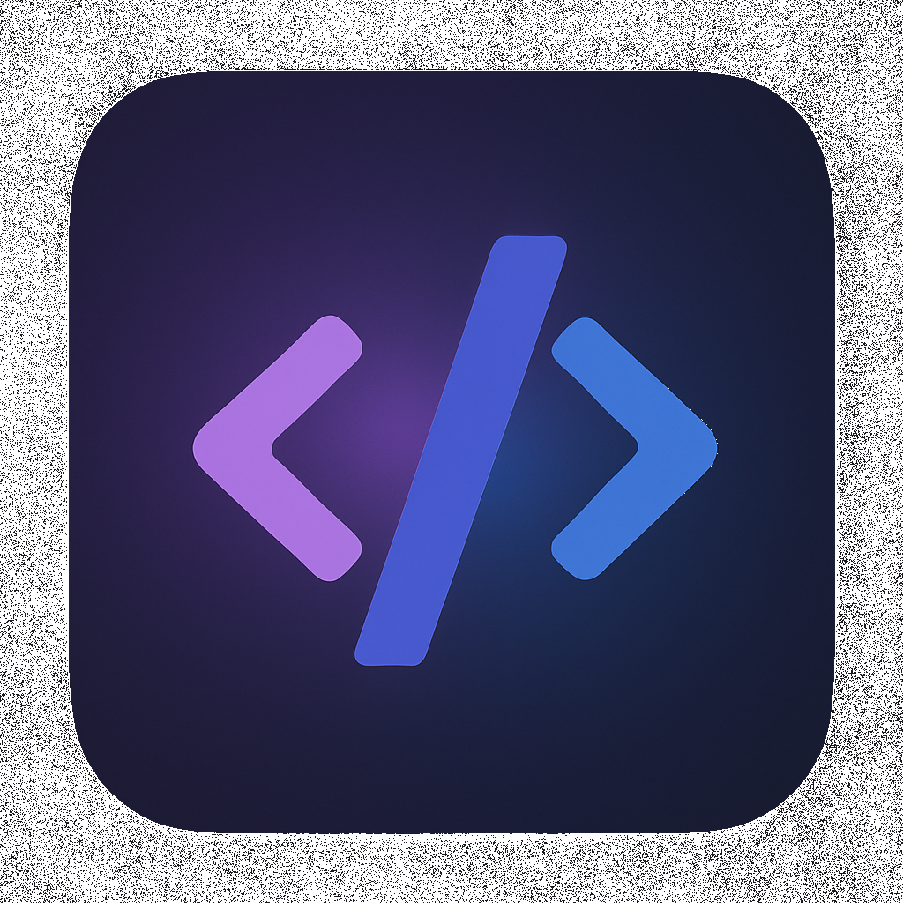
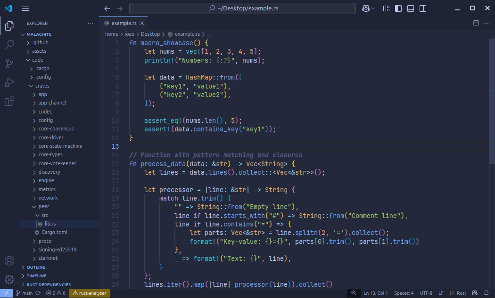
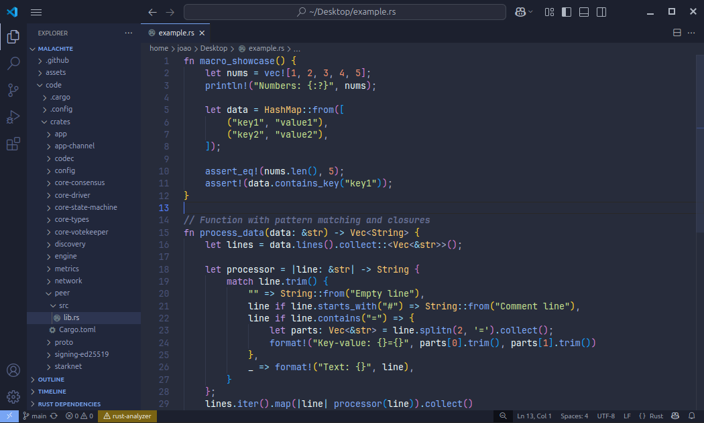

<p align="center">
  
</p>

# Palenight - VS Code Theme

A collection of dark themes for Visual Studio Code inspired by the Palenight and Tokyo Night color palettes.

## There are so many themes out there. Why create another one?

I created this theme primarily out of security concerns with third-party VSCode extensions. The recent security incidents associated with extensions, particularly the one involving the Material Theme, highlighted the risks of trusting third-party extensions, even if they are widely used.

I felt uncomfortable continuing to use third-party themes that could potentially be compromised. Color themes should be simple, static resources that don't need broad system access or connections to external servers.

This entire theme consists of static JSON files that define colors and syntax highlighting rules, nothing more. You can review the entire codebase in minutes to verify this for yourself.

## Features

- **Two theme variants:**
  - **Palenight Storm** - A deeper, more contrasted version with rich blues and purples
  - **Palenight Tokyo** - A softer, more vibrant take with Tokyo-night inspired colors

- **Optimized for multiple languages:**
  - Rust
  - Python
  - JavaScript
  - Go
  - C/C++
  - Bash/Shell
  - HTML/CSS
  - And more...

## Screenshots

### Palenight Tokyo


### Palenight Storm


## 📥 Installation

### Installing from GitHub

1. Clone this repository
```bash
git clone https://github.com/joaotav/palenight-vscode-themes
```

2. Copy the folder to your VS Code extensions directory:
   - **Windows**: `%USERPROFILE%\.vscode\extensions`
   - **macOS/Linux**: `~/.vscode/extensions`
    
3. Restart VS Code
  
4. Open the Command Palette (`Ctrl+Shift+P` or `Cmd+Shift+P`)
   
5. Type `Preferences: Color Theme`
   
6. Select either `Palenight Storm` or `Palenight Tokyo`

## Contributing

Contributions are welcome! Please feel free to submit issues or pull requests.

## License

This project is licensed under the MIT License - see the [LICENSE](LICENSE) file for details.
